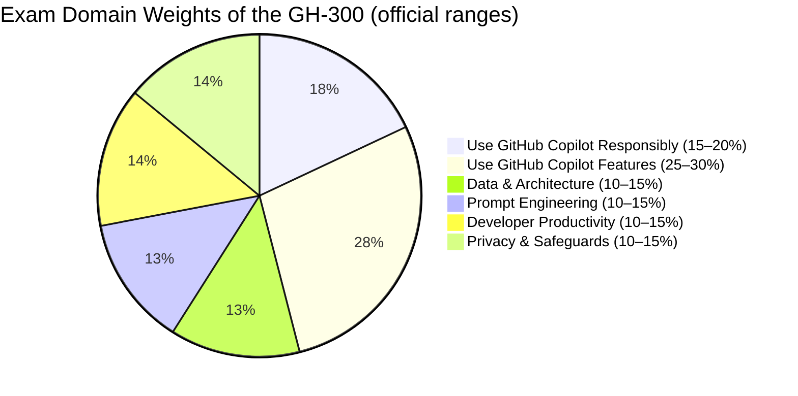

# 📘 GH-300: GitHub Copilot
### Study Notes Repository

[](https://github.com/marcogrimaldi29/gh-300-study-notes/actions/workflows/deploy-pages.yml)
[](https://marcogrimaldi29.com/gh-300-study-notes/)
[](https://marcogrimaldi29.com)

> - 🎯 **Goal:** Earn the GitHub Copilot certification badge
> - 📅 **Notes Version:** 2026 (aligned with the skills measured as of August 7, 2026)
> - 🌐 **Published site:** [📘 GH-300 Study Notes](https://marcogrimaldi29.com/gh-300-study-notes/)
> - ✍️ **Author:** [Marco Grimaldi](https://www.linkedin.com/in/marco-grimaldi29/)
> - 🔗 **Related repos:** [📘 DP-700 Study Notes](https://marcogrimaldi29.com/dp-700-study-notes/)

---

## ⚠️ Disclaimer

These notes are for **personal use and learning purposes only**. They are not affiliated with, endorsed by, or a substitute for the official Microsoft or GitHub certification materials. Content may become outdated as the exam evolves — always verify against the **[official GH-300 study guide](https://learn.microsoft.com/en-us/credentials/certifications/resources/study-guides/gh-300)**.

---

## 📋 Exam At-a-Glance

| Detail | Info |
|--------|------|
| 🏅 Certification | GitHub Copilot Certification (Exam GH-300) |
| 📝 Passing Score | **700 / 1000** |
| ⏱️ Duration | **100 minutes** |
| 🖥️ Delivery | **Pearson VUE** — online proctored or at a test center |
| ❓ Question Types | MCQ, multi-select, and interactive components |
| 🔁 Renewal | **Annual** via free online assessment on Microsoft Learn |
| 🛡️ Prerequisite | **None** *(recommended: hands-on GitHub Copilot experience)* |

---

## 📊 Official Domain Breakdown

> ⚠️ **Official ranges** from the Microsoft study guide, skills measured as of **August 7, 2026**



| # | Domain | Official Weight | Key Topics |
|---|--------|----------------|-------------|
| 1 | Use GitHub Copilot Responsibly | **15–20%** | Responsible AI principles, risks/limitations of GenAI, validating AI output |
| 2 | Use GitHub Copilot Features | **25–30%** | IDE & CLI usage, Agent Mode, Spaces, Spark, org-wide policy management |
| 3 | Understand GitHub Copilot Data & Architecture | **10–15%** | Data flow, proxy filtering, suggestion lifecycle, LLM limitations |
| 4 | Apply Prompt Engineering & Context Crafting | **10–15%** | Prompt structure, zero-/few-shot prompting, chat history |
| 5 | Improve Developer Productivity | **10–15%** | Code generation, testing, refactoring, security suggestions |
| 6 | Configure Privacy, Content Exclusions & Safeguards | **10–15%** | Content exclusions, output ownership, public code filtering |

> 🔑 **Note:** The official guide treats **"Use GitHub Copilot Features"** (IDE, CLI, capabilities, and org-wide management) as a **single 25–30% domain** — this site splits it across two pages (*Copilot in IDE & CLI* and *Capabilities & Policies*) purely for readability, not because it's two separate domains.

---

## 🗂️ Repository Structure

```
gh-300-study-notes/
├── index.html                    ← 📍 Home page (exam overview, skill cards)
├── responsible-ai/               ← Domain 1 (15–20%)
├── copilot-features/             ← Domain 2, part 1 — IDE & CLI (25–30% combined)
├── copilot-capabilities/         ← Domain 2, part 2 — Capabilities & Policies
├── data-architecture/            ← Domain 3 (10–15%)
├── prompt-engineering/           ← Domain 4 (10–15%)
├── developer-productivity/       ← Domain 5 (10–15%)
├── privacy-safeguards/           ← Domain 6 (10–15%)
├── exam-tips/                    ← Exam strategy, caveats & study plan
├── assets/
│   ├── css/style.css             ← GitHub-dark design system
│   ├── js/main.js                ← sidebar nav, scroll behavior, code rain
│   └── images/                   ← logo and author photo
└── sitemap.xml
```

---

## 📚 Official Learning Resources

| Resource | Link |
|----------|------|
| 📋 Skills Measured / Study Guide | [Official Study Guide](https://learn.microsoft.com/en-us/credentials/certifications/resources/study-guides/gh-300) |
| 📄 Certification Page | [GH-300 Certification](https://learn.microsoft.com/en-us/credentials/certifications/github-copilot/) |
| 🎓 Learning Paths | [Copilot Fundamentals Part 1](https://learn.microsoft.com/en-us/training/paths/copilot/) & [Part 2](https://learn.microsoft.com/en-us/training/paths/gh-copilot-2/) |
| 🎓 Instructor-Led Course | [GH-300T00-A](https://learn.microsoft.com/en-us/training/courses/gh-300t00) |
| 🧪 Free Practice Assessment | [Practice Assessment](https://learn.microsoft.com/en-us/credentials/certifications/github-copilot/?practice-assessment-type=certification) |
| 🕹️ Exam Sandbox | [Exam Sandbox](https://aka.ms/GHExamDemo-enu) |
| 📚 GitHub Copilot Docs | [docs.github.com/copilot](https://docs.github.com/en/copilot) |
| 🔒 Data, Privacy & Security | [GitHub Trust Center](https://github.com/trust-center) |

---

### ✅ Key Study Tips

- 🎯 The exam tests **which Copilot feature or setting applies**, not just what Copilot does — think in terms of scope (IDE vs. org-wide) and plan tier
- 🧩 Know your **Copilot plans** cold — Free, Pro, Pro+, Max, Business, and Enterprise — and which features (content exclusions, audit logs, policy management) require Business/Enterprise
- ⚙️ Don't confuse **Content Exclusions** (controls what Copilot can *see*) with **duplication detection / public code filtering** (controls what Copilot can *suggest*)
- 🖥️ Know the difference between the **retired `gh copilot suggest/explain` extension** and the **current agentic Copilot CLI**
- ✍️ Study **prompt engineering fundamentals** — zero-shot vs. few-shot prompting, context determination, and chat history usage
- 🔄 Understand the **code suggestion lifecycle** end-to-end: input processing → prompt building → proxy filtering → post-processing
- 📖 Read every question for **scope** first (individual IDE setting vs. organization policy) before choosing an answer

---

## ⚡ Quick Navigation

| Page | Topics Covered |
|------|---------------|
| [📘 Home](https://marcogrimaldi29.com/gh-300-study-notes/) | Exam overview, skill weight breakdown, official resources |
| [⚖️ Responsible AI](https://marcogrimaldi29.com/gh-300-study-notes/responsible-ai/) | Responsible AI principles, risks, validating AI output |
| [💻 Copilot in IDE & CLI](https://marcogrimaldi29.com/gh-300-study-notes/copilot-features/) | Enabling Copilot, inline suggestions, Chat, CLI commands |
| [⚙️ Capabilities & Policies](https://marcogrimaldi29.com/gh-300-study-notes/copilot-capabilities/) | Agent Mode, MCP, Spaces, Spark, org-wide management |
| [☁️ Data & Architecture](https://marcogrimaldi29.com/gh-300-study-notes/data-architecture/) | Data flow, proxy filtering, suggestion lifecycle |
| [💬 Prompt Engineering](https://marcogrimaldi29.com/gh-300-study-notes/prompt-engineering/) | Prompt structure, zero-/few-shot prompting, best practices |
| [🚀 Developer Productivity](https://marcogrimaldi29.com/gh-300-study-notes/developer-productivity/) | Code generation, testing, security, SDLC integration |
| [🔒 Privacy & Safeguards](https://marcogrimaldi29.com/gh-300-study-notes/privacy-safeguards/) | Content exclusions, output ownership, troubleshooting |
| [📝 Exam Tips & Caveats](https://marcogrimaldi29.com/gh-300-study-notes/exam-tips/) | Exam strategy, common pitfalls, study plan |

---

## 📚 About the Study Notes

These notes are hosted on **GitHub Pages** and published as a website at:

👉 **[📘 GH-300 Study Notes](https://marcogrimaldi29.com/gh-300-study-notes/)**

The site is a custom-built static site (HTML, CSS, and vanilla JavaScript — no build tools or static site generator) with clean folder-style URLs and mobile-friendly navigation.

These notes are designed to be a structured, exam-focused summary of the most important concepts and services based on the official [Microsoft GH-300 Study Guide](https://learn.microsoft.com/en-us/credentials/certifications/resources/study-guides/gh-300) and GitHub Copilot documentation.

---

## ✍️ About the Author

Maintained by **[Marco Grimaldi](https://www.linkedin.com/in/marco-grimaldi29/)** — Cloud Solution Architect.

Find more certification guides, study tips, and tech content at **[🏠 marcogrimaldi29.com](https://marcogrimaldi29.com)**

The site is continuously updated based on personal study notes and experience with GitHub Copilot. If you have feedback, corrections, or spot outdated content, feel free to open an issue or PR.

> ⭐ If these notes helped you on your GH-300 journey, consider giving the repo a **star** — it helps others discover these resources and motivates continued updates!

---

## 📈 Analytics

This site uses [Umami](https://umami.is/) for privacy-friendly, cookieless analytics. The website ID is injected at build time from a repository secret ([`UMAMI_WEBSITE_ID`](.github/workflows/deploy-pages.yml)) and is never committed to source.

---

## 🤝 Contributing

Corrections, improvements, and pull requests are welcome — open an issue or PR on GitHub.

---

## ©️ Credits & Acknowledgements

Created with the help of AI (Claude, Anthropic). The content has been reviewed and edited by the author for accuracy and clarity, but may contain errors. Always verify against the latest [GitHub Copilot documentation](https://docs.github.com/en/copilot) and [official study guide](https://learn.microsoft.com/en-us/credentials/certifications/resources/study-guides/gh-300).

> *Not affiliated with or endorsed by Microsoft or GitHub.*

---
