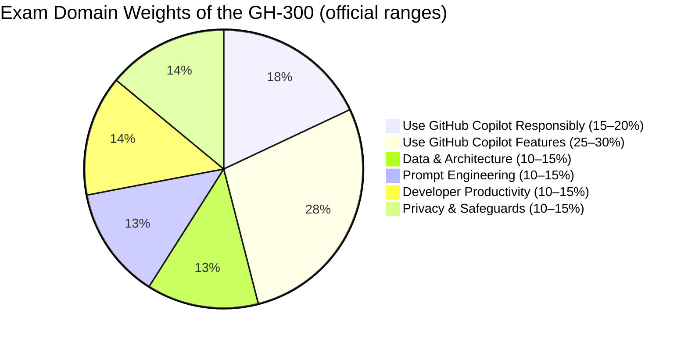

# 📘 GH-300: GitHub Copilot
### Study Notes Repository

> - 🎯 **Goal:** Earn the GitHub Copilot certification badge
> - 📅 **Notes Version:** 2026 (aligned with the skills measured as of August 7, 2026)
> - 🌐 **Published site:** [📘 GH-300 Study Notes](https://marcogrimaldi29.com/gh-300-study-notes/)
> - ✍️ **Author:** [Marco Grimaldi](https://www.linkedin.com/in/marco-grimaldi29/)
> - 🔗 **Related repos:** [📘 DP-700 Study Notes](https://marcogrimaldi29.com/dp-700-study-notes/)

---

## ⚠️ Disclaimer

These notes are for **personal use and learning purposes only**. They are not affiliated with, endorsed by, or a substitute for the official Microsoft or GitHub certification materials. Content may become outdated as the exam evolves — always verify against the **[official GH-300 study guide](https://learn.microsoft.com/en-us/credentials/certifications/resources/study-guides/gh-300)**.

---

## 📋 Exam At-a-Glance

| Detail | Info |
|--------|------|
| 🏅 Certification | GitHub Copilot Certification (Exam GH-300) |
| 📝 Passing Score | **700 / 1000** |
| ⏱️ Duration | **100 minutes** |
| 🖥️ Delivery | **Pearson VUE** — online proctored or at a test center |
| ❓ Question Types | MCQ, multi-select, and interactive components |
| 🔁 Renewal | **Annual** via free online assessment on Microsoft Learn |
| 🛡️ Prerequisite | **None** *(recommended: hands-on GitHub Copilot experience)* |

---

## 📊 Official Domain Breakdown

> ⚠️ **Official ranges** from the Microsoft study guide, skills measured as of **August 7, 2026**

```mermaid
pie title Exam Domain Weights of the GH-300 (official ranges)
    "Use GitHub Copilot Responsibly (15–20%)" : 18
    "Use GitHub Copilot Features (25–30%)" : 28
    "Data & Architecture (10–15%)" : 13
    "Prompt Engineering (10–15%)" : 13
    "Developer Productivity (10–15%)" : 14
    "Privacy & Safeguards (10–15%)" : 14
```

## 🐞 Spotted a Mistake?

GitHub Copilot evolves fast, so if something here is wrong or out of date, please [report an issue](https://github.com/marcogrimaldi29/gh-300-study-notes/issues).

---

## 💚 Support

If these notes helped you prepare for GH-300, there are a few ways to show it: ⭐ star this repo on GitHub so other candidates can find it, 🤝 connect with me on LinkedIn, or ☕ support the work behind them with a coffee.

  
  
  

---

## ©️ Credits & Acknowledgements

Created with the help of AI (Claude, Anthropic). The content has been reviewed and edited by the author for accuracy and clarity, but may contain errors. Always verify against the latest [GitHub Copilot documentation](https://docs.github.com/en/copilot) and [official study guide](https://learn.microsoft.com/en-us/credentials/certifications/resources/study-guides/gh-300).

> *Not affiliated with or endorsed by Microsoft or GitHub.*

---
